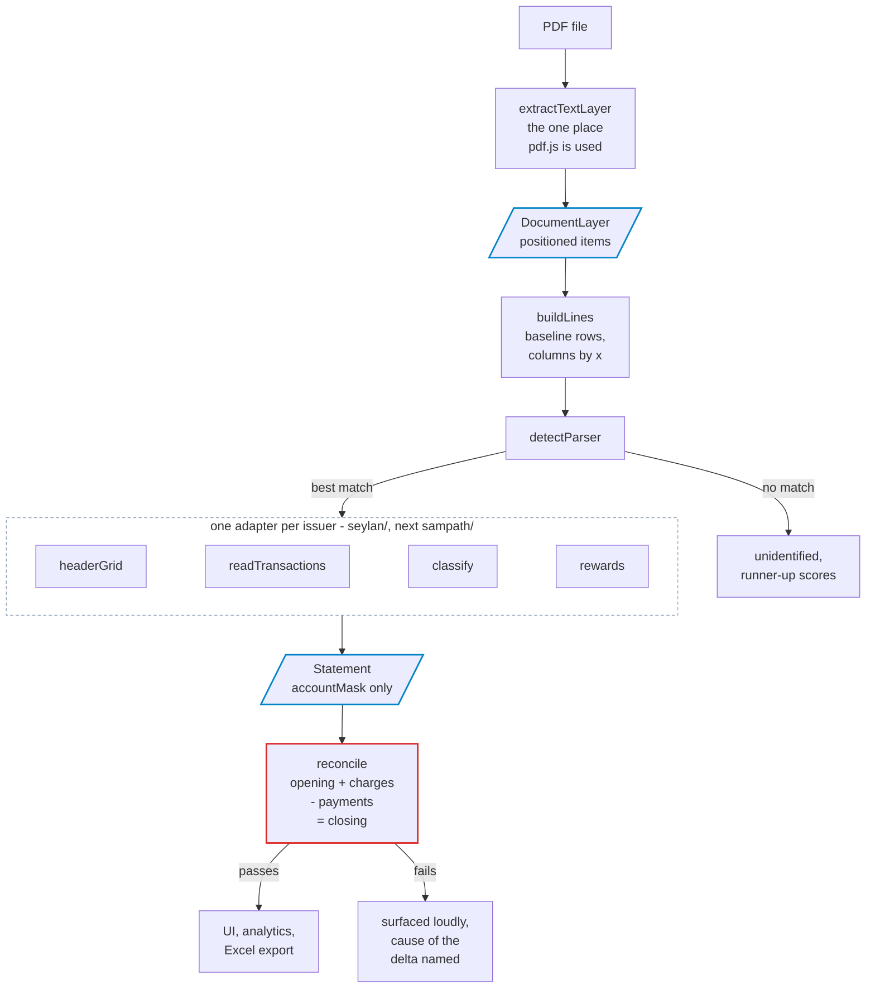

# Credit Card Statement Analyser

Local-first analysis of Sri Lankan credit card e-statements. Statements are
parsed and analysed **entirely in the browser** — no upload endpoint, no
third-party API, no telemetry, no analytics. There is no backend to send a
statement to even if something tried.

## Status

Build order from the brief, with step 1 complete:

| Step | Scope | State |
|---|---|---|
| 1 | Types, Seylan parser, fixtures, reconciliation tests | **done** |
| 2 | Sampath parser (embedded dates, multi-page) | not started |
| 3 | `ReversalMatcher`, payments/reversals split | **done** |
| 4 | Instalment registry, cost of credit | **done** |
| 5 | Analytics: gaps, decomposition, forward schedule | **done** |
| 6 | UI, categories, anomalies | **done** |
| 7 | Excel export | not started |

Seylan statements parse; Sampath does not yet, so the issuer registry has one
adapter in it. Everything downstream of the parser is issuer-agnostic and will
pick Sampath up without change.

```
npm install
npm test         # 58 tests
npm run dev      # local dev server
npm run dump     # prints the parser's reading of the fixture statement
npm run build    # static build, deployable to any static host
```

## Hosting

Pushes to `main` or any `claude/**` branch run the test suite and, if it is
green, publish `dist/` to GitHub Pages (`.github/workflows/deploy.yml`). A red
suite blocks the deploy.

The build uses a relative base (`base: './'`), so it works from a repository
subpath, a custom domain or a local `file://` copy without reconfiguration.

Hosting the page is safe precisely because the page does nothing server-side:
it is static files, and every statement is read in the visitor's own browser.
This was verified against the production build served from a subpath — the
page issues **no off-origin requests at all**, before or during a parse.

## How it is put together



**There is no server in that diagram because there is no server.** Every box
runs inside the visitor's browser tab. The PDF bytes come from a local `File`
and go to a worker on the same machine; nothing is uploaded, and the app has
no endpoint to upload to.

Two boundaries in the diagram are doing real work:

- **`DocumentLayer` is where pdf.js stops.** No parser imports it, which is
  what makes adapters testable from a recorded layer and what stops a pdf.js
  upgrade from rippling into parsing logic.
- **`Statement` is where the card number is already gone.** Masking happens
  during the header read, not before display, so no later mistake can leak a
  number that was never kept.

### Why positions and not page text

A statement's meaning is carried by its columns. Flattening the page to a
string throws that away, and the amount column is exactly where it hurts:

```
x =  40        92        148                               470      548 ┤right
     │         │         │                                 │           │
     06/03/26  05/03/26  075233 NETFLIX.COM SINGAPORE      LKR   4,390.50
     └ posted ┘└─ txn ──┘└ ref ─┘└──── description ───────┘ └curr┘└ amount ┘

     USD   14.99     ← continuation line, attached to the row above;
                       implied rate derived as 4,390.50 / 14.99 = 292.90
```

The amount is read from the **rightmost** token on the row, not by a regex over
the line, so a description that happens to end in something amount-shaped
cannot be mistaken for the amount. A bare `CR` extracted as its own token is
folded back onto the number beside it — which is how a credit keeps its sign.

The same reasoning drives `headerGrid`: a label and its value are paired by
column position, so a blank cell shifts nothing, and `FINANCE CHARGE` appearing
as both a header field and a transaction description cannot cross-contaminate.

### Module map

```
src/domain/types.ts        the domain model and the money sign convention
src/lib/money.ts           amount parsing, including the CR-suffix rule
src/lib/mask.ts            card masking, applied at the point of extraction
src/lib/dates.ts           day-first date parsing, no assumed cycle day
src/parsing/pdf.ts         the only pdf.js dependency in the codebase
src/parsing/textLayer.ts   positioned text items -> rows -> gap-aware strings
src/parsing/headerGrid.ts  label/value grids read by column
src/parsing/classify.ts    transaction classification rules
src/parsing/rewards.ts     the rewards identity solver
src/parsing/parser.ts      StatementParser interface + issuer registry
src/parsing/seylan/        the Seylan adapter
src/analysis/reconcile.ts  opening + charges - payments = closing
src/state/                 in-memory statement library, duplicate detection
src/ui/                    upload panel and statement view
```

Adding a third issuer is a new file implementing `StatementParser` plus one
`registerParser` call. Nothing else changes.

### Fixtures

Fixture PDFs are **generated from a declarative layout** (`tests/helpers/makePdf.ts`)
rather than checked in as binaries. No real statement data is in this
repository, and every fixture's content is reviewable as source. The generated
PDF has a genuine text layer, so tests run the same pdf.js path the browser
does rather than a mock.

To run the parser against your own statements locally, drop them in
`tests/fixtures/private/` — that directory and all `*.pdf` files are
gitignored.

## The app

Seven routes, all client-side, hash-routed so the build works from a
repository subpath or a local `file://` copy with no server to rewrite paths.

| Route | What it answers |
|---|---|
| **Upload** | Per-file parse status, and why a file was refused |
| **Overview** | Position per card, true obligation, and what looks wrong |
| **Cycles** | The reconciliation table, with missing statements marked inline |
| **Instalments** | The plan register and what each plan costs to carry |
| **Forward** | The obligation curve, and what settling a plan early is worth |
| **Categories** | Spend by purpose, on an economic or a cash basis |
| **Transactions** | Every line, filterable, with CSV export |

Three things in the UI are load-bearing rather than decorative:

- **Series colours are validated, not chosen by eye.** The three categorical
  slots clear colourblind-separation, normal-vision and lightness gates against
  both the light and the dark surface. Dark is a selected set of steps for the
  dark surface, not an inversion of light. Light-mode aqua sits under 3:1 by
  design, so every chart using it carries a legend and direct labels — colour
  never carries identity alone.
- **No chart without a stated unit**, and no dual-axis chart anywhere. Monthly
  obligation and cumulative outflow differ by an order of magnitude, so they are
  two charts rather than two y-scales on one.
- **Charts do not animate.** A dense analytical view is read, not watched.

## Privacy properties, and how they are enforced

- **Masking happens at extraction.** `maskCardNumber` is called on the header
  match and the full value is discarded in the same expression. A test asserts
  that no run of 8+ digits survives into the serialised statement.
- **No network from the PDF layer.** `getDocument` is given local bytes with
  `useWorkerFetch: false` and no CMap or standard-font URL configured, so
  pdf.js has nothing to fetch.
- **No third-party script** in `index.html`.

## Assumptions in the Seylan adapter

These are inferences from the described layout, not things I have verified
against a real statement. Each one is a place the parser could be wrong on
your PDFs, and each fails loudly rather than silently:

1. **The finance charge is inside `New Charges & Debits`.** The `Finance
   Charge (int)` header field is read as a disclosure of the interest portion,
   not as an amount to add on top. If your issuer prints it outside the charges
   total, the invariant will fail by exactly the finance charge and
   `reconcile()` says so in as many words rather than quietly adding it.
2. **Per-card subtotals are net movement** (debits less credits for that card),
   not gross debits. Both per-card sums and their total are cross-checked
   against the header.
3. **A reference is a leading token** of 6+ digits or 8+ alphanumerics at the
   head of the description column. If Seylan prints references in their own
   positional column, this should become a column read instead.
4. **Instalment plans are keyed on the issuer's own plan code when it prints
   one.** Seylan's `SP 010 of 036` appears on both the repayment and its
   processing fee, which is definitive. Falling back to the merchant name would
   split them — the fee line names no merchant at all, since every word in
   `EASY PAY PROCESSING FEE` is programme wording. Sampath prints no such code,
   and there the fee line does repeat the merchant, so merchant plus term is the
   right key.
5. **`fuel_surcharge` was added to `TxnClass`.** The specified set had only
   `fuel_surcharge_reversal`, which left the levy itself with nowhere to go
   except `purchase` — that would overstate spending and make the "surcharge
   levied without a matching reversal" anomaly undetectable.
6. **Rewards pairs are left open rather than guessed.** See below.

## The reversal mechanic, and why every total depends on it

An instalment purchase is not one line. The issuer posts the purchase at full
value, reverses it the next day, and re-books it as a schedule:

```
15/03  DAMRO - KOTTAWA                        206,831.00     origination
16/03  DAMRO - KOTTAWA                        206,831.00CR   reversal
16/03  DAMRO INSTALLMENT REPAYMENT 1/36         5,745.31     first instalment
16/03  DAMRO INSTALLMENT PROCESSING FEES        1,654.65     recurring fee
```

Summing gross debits counts that purchase twice — once at full value and again
as its schedule. Treating the credit as a payment says the cardholder settled
206,831 they never paid. So `ReversalMatcher` pairs each origination with its
reversal on amount, a short date window and a fuzzy merchant match, and
`trueCharges = grossDebits − matchedReversals`. Every credit is then either a
payment or a reversal, decided line by line.

Two consequences worth stating:

- **A reversed charge that was never financed is not spending in either view.**
  A fuel surcharge levied and refunded did not happen. Only a reversal that was
  re-booked as a plan counts at full value in the economic view.
- **A credit with no matching debit anywhere is reported, not absorbed.** Either
  the originating cycle is not loaded, or the bank credited something it never
  charged. Both are worth knowing; neither is silently netted off.

## Two decisions worth knowing about

### The rewards block

The brief asks for the assignment satisfying
`opening + accumulated − redeemed − adjusted = balance`. That identity is
symmetric within two pairs: swapping `opening` with `accumulated` leaves it
true, as does swapping `redeemed` with `adjusted`. So it proves which value is
the balance and which two are added versus subtracted — but not the order
inside either pair.

The obvious tie-breaker is unusable. If the labels had lined up with the
values, the positional reading would already have satisfied the identity; the
only reason to be solving is that it did not, which means the labels are known
mis-aligned and cannot order a pair either.

So the parser reports what it actually knows: the balance, the additive pair,
the subtractive pair, and an explicit note that the order within each is
undetermined. It is then closed without guessing — the previous cycle's
closing points balance *is* this cycle's opening balance, so
`resolveWithPriorBalance` finishes the job as soon as a second statement is
loaded.

### Reconciliation failures name their cause

`reconcile()` does not just report a delta. When the delta's shape identifies a
specific cause — it equals the finance charge, it is twice the payments total
(a credit-column sign error), or the header and the line items disagree — it
says so.

## Non-goals

Bank API integration. Multi-user accounts. Anything that transmits statement
data. Tax filing. Investment or financial advice — this reports what the
statements say and flags what looks wrong; it does not recommend.
